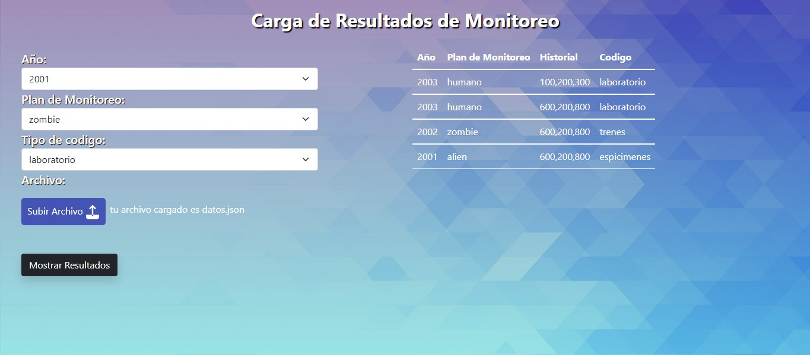

# Como usar el proyecto CARGA MASIVA

- 1. ejecutarlo en un servidor
- 2. cuando se abre por primera vez el proyecto esta vacio, pero tiene que ser cargado
- 3. dentro de la carpeta raiz hay un archivo llamado datos.json, eso cargarlo en el boton Subir Archivo
- 4. cuando el archivo se haya subido dentro de los select se habra cargado los datos con la informacion del json
- 5. se puede seleccionar y evaluara los que cumplan al menos una condicion y cuando se de el boton Mostrar Resultados, se mostrará una tabla con informacion simulada.

### Tecnologias

- quise usar javaScrip vanilla ya que considero importante ver como se hace antes de usar una libreria o framework y entender el porque.
- use BootStrap y estilos css3 propios.

### Antes - Prueba

### Despues - Proyecto

### Extras

- Set -> use la estructura de datos set porque en el archivo json hay tipos de datos repetidos, entences en el select repetia datos, lo que hice fue ver si hay datos repetidos ponerlo en uno solo pero no modifica el json.

# carga-masiva-de-datos
